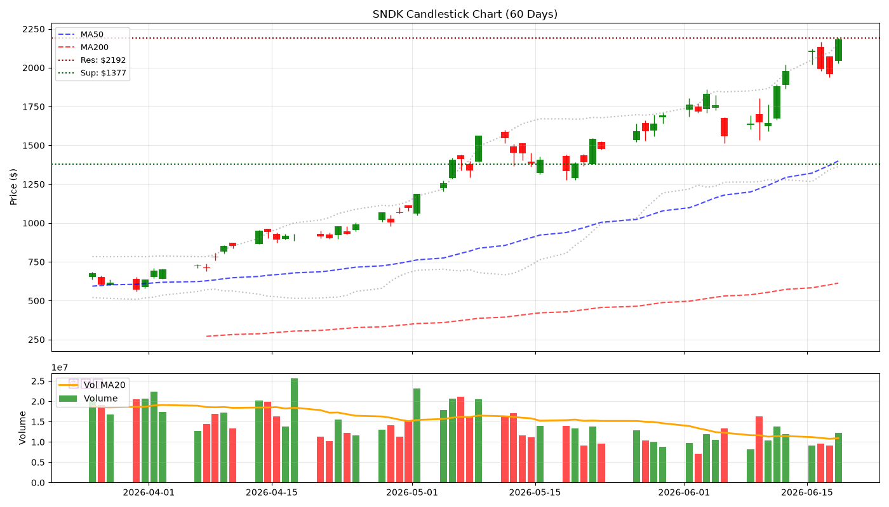
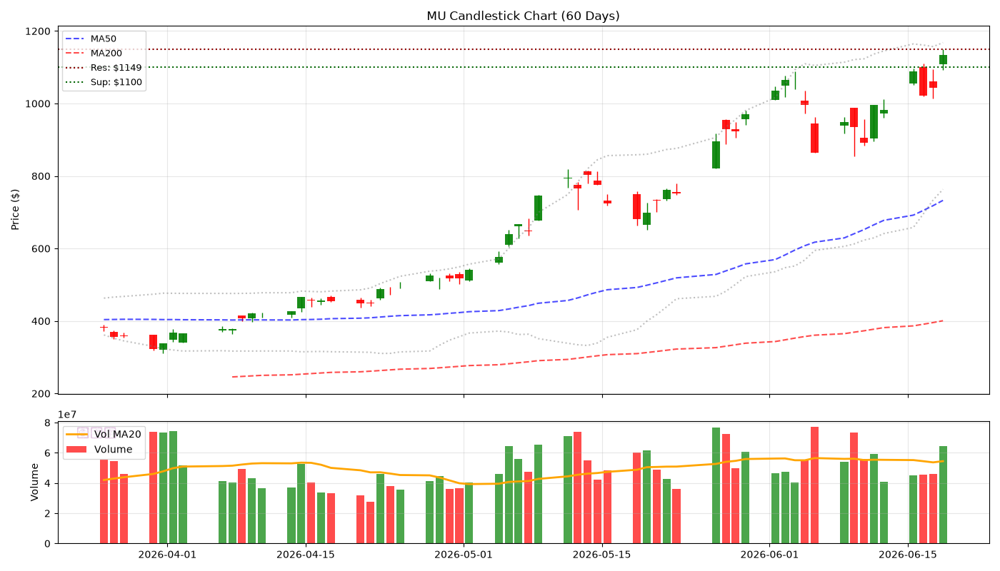
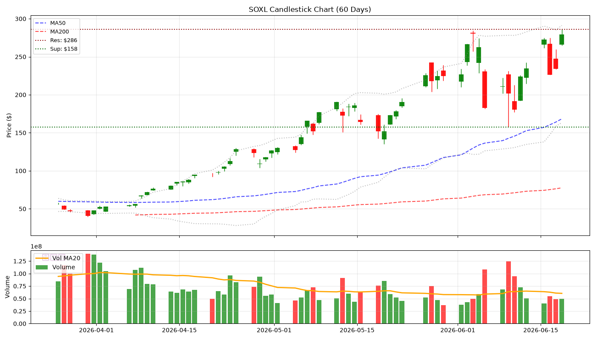
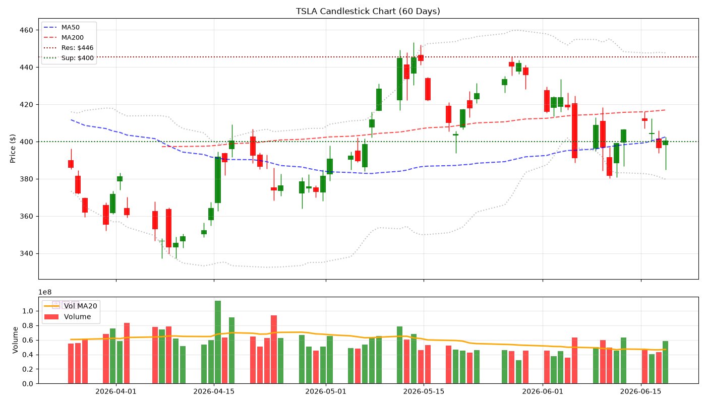
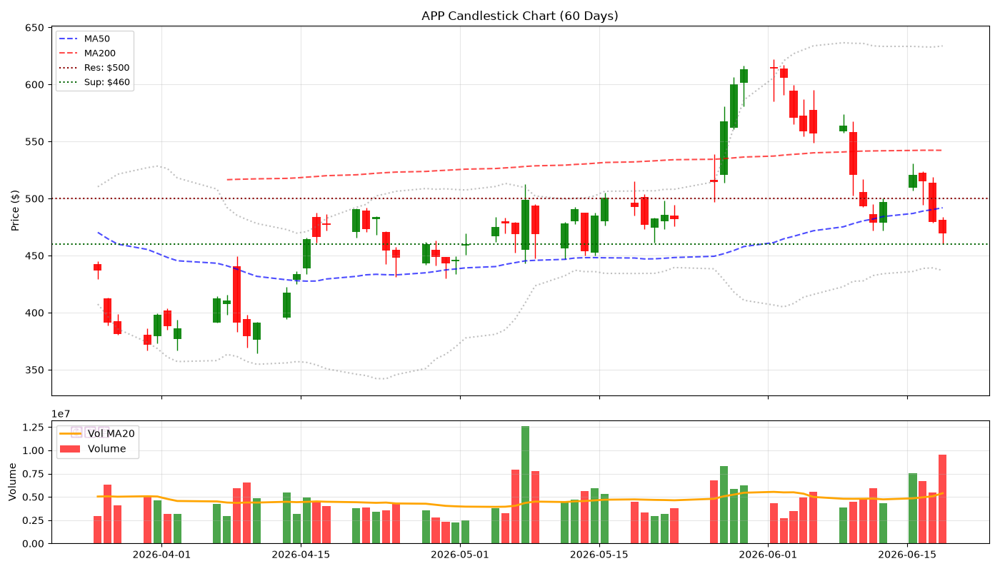
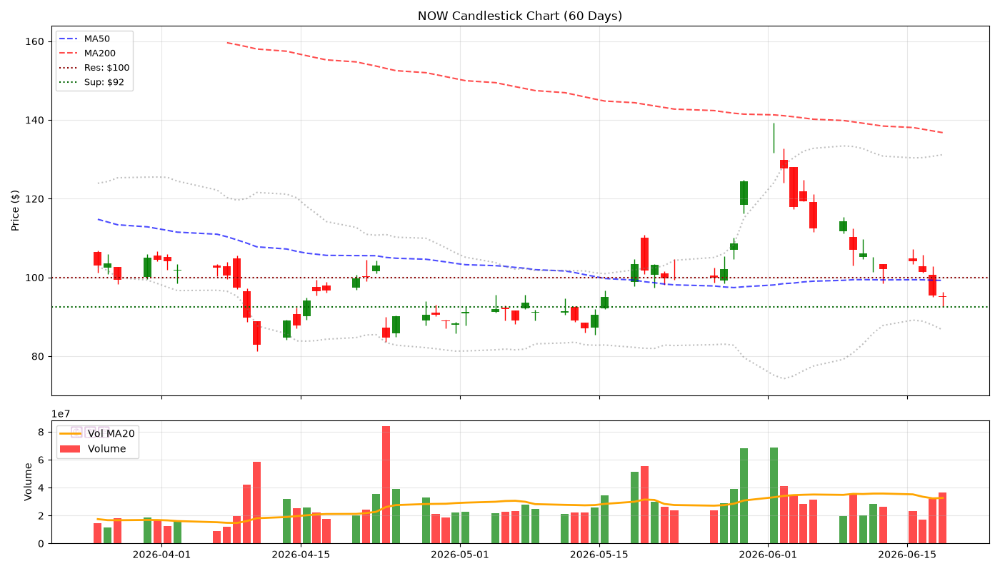
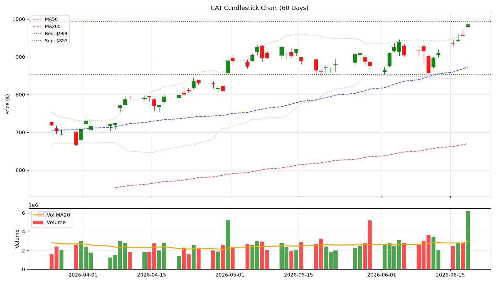
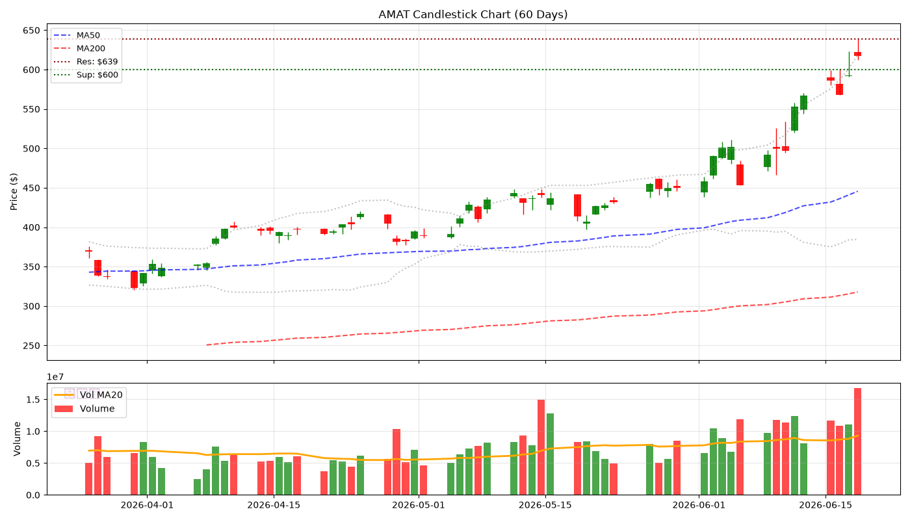
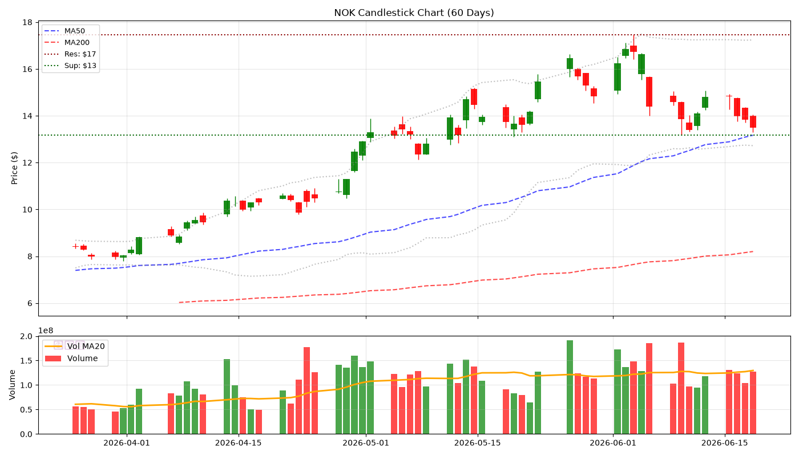
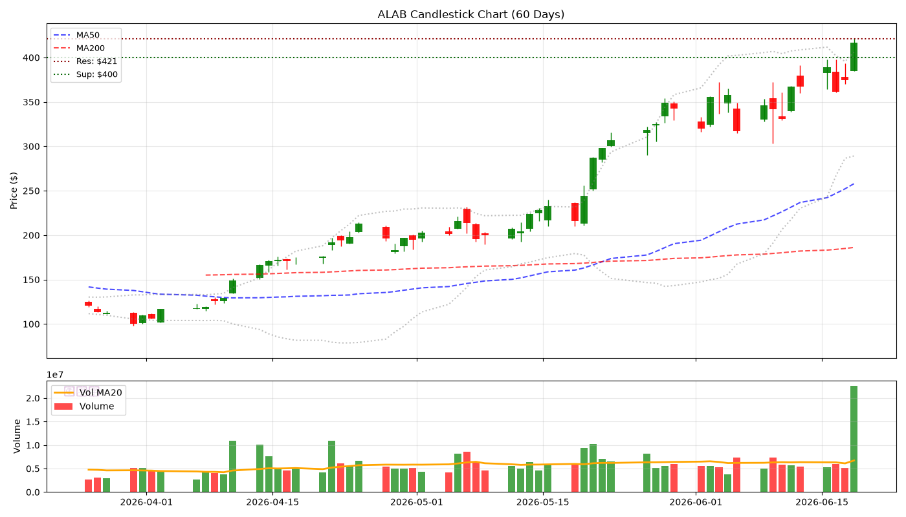

# 🕯️ Hermes V5 陰陽燭專業日報 - 2026-06-21
> **生成時間**: 2026-06-21 01:03:55 | **圖表**: 正宗陰陽燭 + Volume

---

## 📊 核心數據

| 股票 | 價格 | 漲跌% | RSI | 成交量 | 阻力 | 支撐 |
|------|------|-------|-----|--------|------|------|
| SNDK | $2184.75 | +11.54% | 67.1 | 💧 | $2192 | $1377 |
| MU | $1133.99 | +8.70% | 59.3 | 💧 | $1149 | $1100 |
| SOXL | $279.29 | +19.43% | 56.8 | 💧 | $286 | $158 |
| TSLA | $400.49 | +1.04% | 38.6 | 💧 | $446 | $400 |
| APP | $469.71 | -2.04% | 20.4 | 🔥 | $500 | $460 |
| NOW | $95.04 | -0.46% | 26.6 | 💧 | $100 | $92 |
| CAT | $985.82 | +3.13% | 67.1 | 🔥 | $994 | $853 |
| AMAT | $617.11 | +4.08% | 77.5 | 🔥 | $639 | $600 |
| NOK | $13.49 | -2.46% | 42.2 | 💧 | $17 | $13 |
| ALAB | $417.07 | +11.31% | 62.4 | 🔥 | $421 | $400 |

---

## 📈 個股陰陽燭分析

### SNDK ($2184.75, +11.54%)

- **RSI**: 67.1 | **Vol**: NORMAL
- **關鍵位**: 阻力 $2191.69 | 支撐 $1377.47

### MU ($1133.99, +8.70%)

- **RSI**: 59.3 | **Vol**: NORMAL
- **關鍵位**: 阻力 $1149.43 | 支撐 $1100.00

### SOXL ($279.29, +19.43%)

- **RSI**: 56.8 | **Vol**: NORMAL
- **關鍵位**: 阻力 $286.15 | 支撐 $157.56

### TSLA ($400.49, +1.04%)

- **RSI**: 38.6 | **Vol**: NORMAL
- **關鍵位**: 阻力 $445.60 | 支撐 $400.00

### APP ($469.71, -2.04%)

- **RSI**: 20.4 | **Vol**: HIGH
- **關鍵位**: 阻力 $500.00 | 支撐 $460.20

### NOW ($95.04, -0.46%)

- **RSI**: 26.6 | **Vol**: NORMAL
- **關鍵位**: 阻力 $100.00 | 支撐 $92.45

### CAT ($985.82, +3.13%)

- **RSI**: 67.1 | **Vol**: HIGH
- **關鍵位**: 阻力 $994.49 | 支撐 $853.37

### AMAT ($617.11, +4.08%)

- **RSI**: 77.5 | **Vol**: HIGH
- **關鍵位**: 阻力 $638.90 | 支撐 $600.00

### NOK ($13.49, -2.46%)

- **RSI**: 42.2 | **Vol**: NORMAL
- **關鍵位**: 阻力 $17.45 | 支撐 $13.18

### ALAB ($417.07, +11.31%)

- **RSI**: 62.4 | **Vol**: HIGH
- **關鍵位**: 阻力 $421.20 | 支撐 $400.00

*Generated by Hermes Agent V5 (Candlestick Pro)*