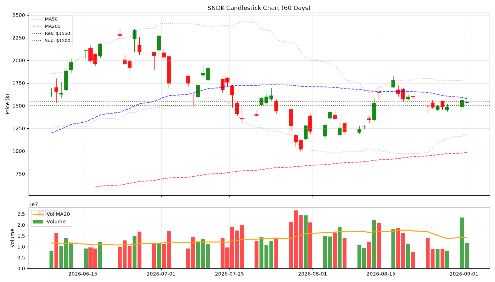
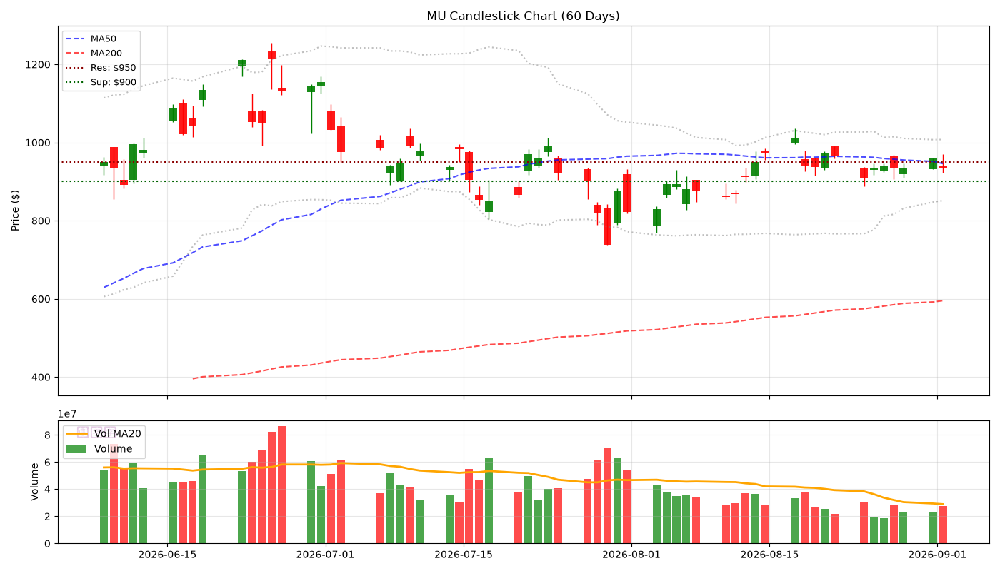
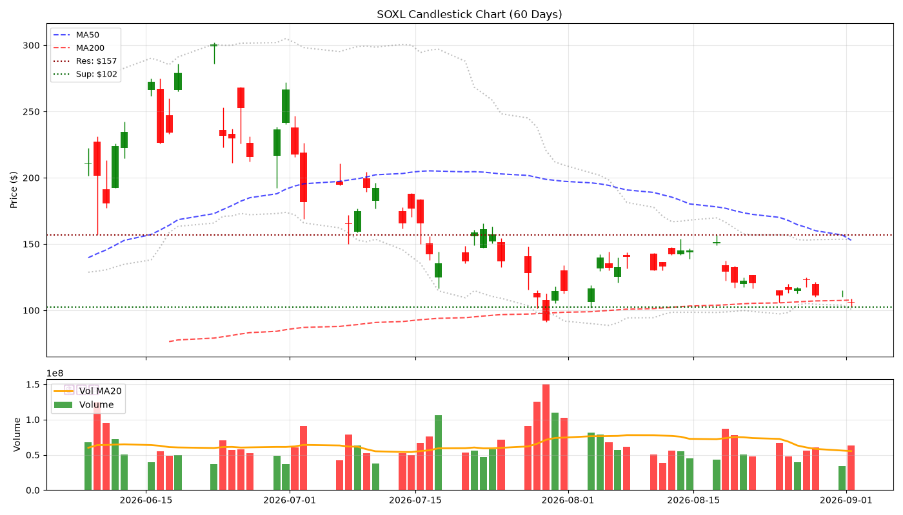
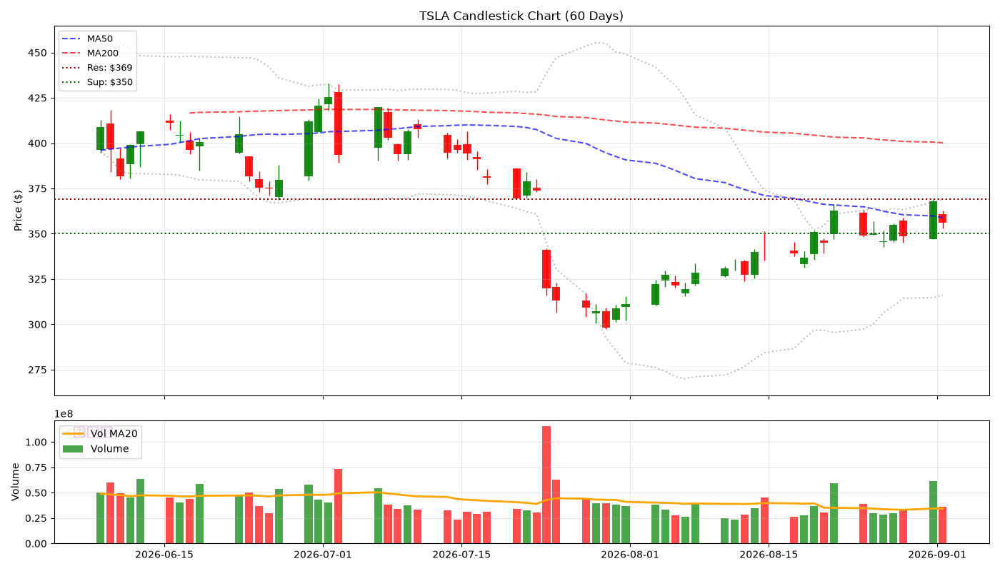
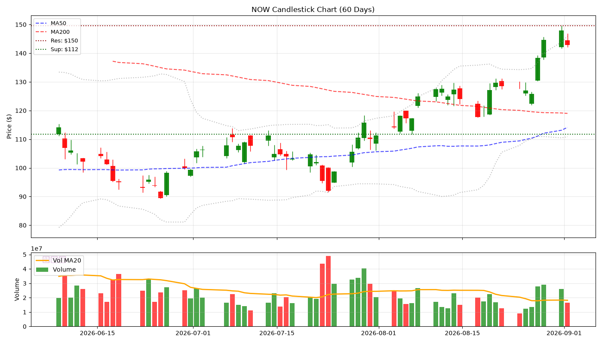
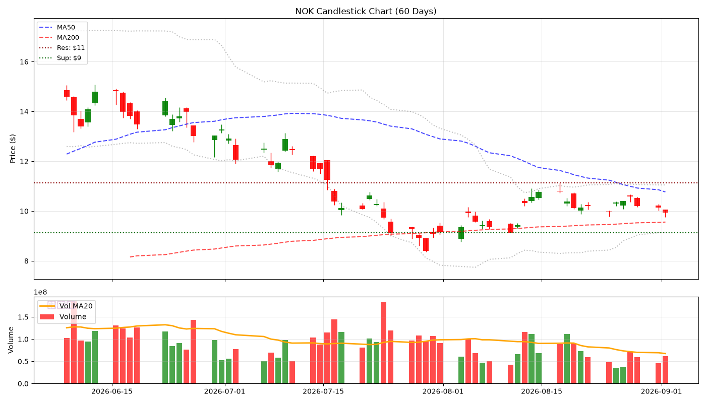
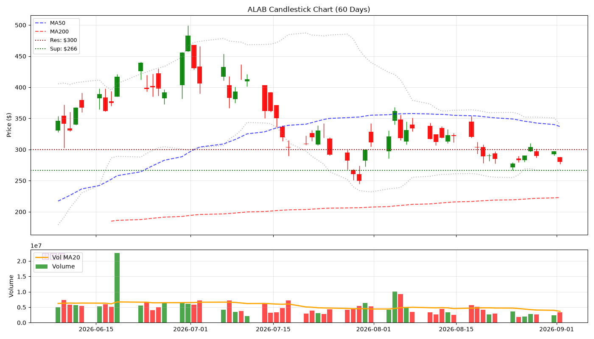

# 🕯️ Hermes V5 陰陽燭專業日報 - 2026-09-02
> **生成時間**: 2026-09-02 06:00:55 | **圖表**: 正宗陰陽燭 + Volume

---

## 📊 核心數據

| 股票 | 價格 | 漲跌% | RSI | 成交量 | 阻力 | 支撐 |
|------|------|-------|-----|--------|------|------|
| SNDK | $1536.87 | -1.90% | 60.1 | 💧 | $1550 | $1500 |
| MU | $933.44 | -2.64% | 53.1 | 💧 | $950 | $900 |
| SOXL | $105.91 | -6.10% | 28.8 | 💧 | $157 | $102 |
| TSLA | $356.09 | -3.22% | 61.5 | 💧 | $369 | $350 |
| NOW | $142.90 | -3.44% | 66.3 | 💧 | $150 | $112 |
| NOK | $9.93 | -2.07% | 42.9 | 💧 | $11 | $9 |
| ALAB | $279.91 | -5.75% | 33.5 | 💧 | $300 | $266 |

---

## 📈 個股陰陽燭分析

### SNDK ($1536.87, -1.90%)

- **RSI**: 60.1 | **Vol**: NORMAL
- **關鍵位**: 阻力 $1550.00 | 支撐 $1500.00

### MU ($933.44, -2.64%)

- **RSI**: 53.1 | **Vol**: NORMAL
- **關鍵位**: 阻力 $950.00 | 支撐 $900.00

### SOXL ($105.91, -6.10%)

- **RSI**: 28.8 | **Vol**: NORMAL
- **關鍵位**: 阻力 $156.92 | 支撐 $102.31

### TSLA ($356.09, -3.22%)

- **RSI**: 61.5 | **Vol**: NORMAL
- **關鍵位**: 阻力 $368.92 | 支撐 $350.00

### NOW ($142.90, -3.44%)

- **RSI**: 66.3 | **Vol**: NORMAL
- **關鍵位**: 阻力 $149.60 | 支撐 $111.80

### NOK ($9.93, -2.07%)

- **RSI**: 42.9 | **Vol**: NORMAL
- **關鍵位**: 阻力 $11.13 | 支撐 $9.12

### ALAB ($279.91, -5.75%)

- **RSI**: 33.5 | **Vol**: NORMAL
- **關鍵位**: 阻力 $300.00 | 支撐 $266.31

*Generated by Hermes Agent V5 (Candlestick Pro)*