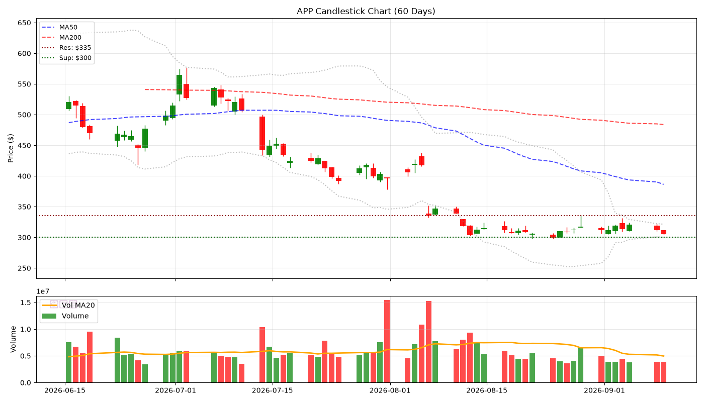
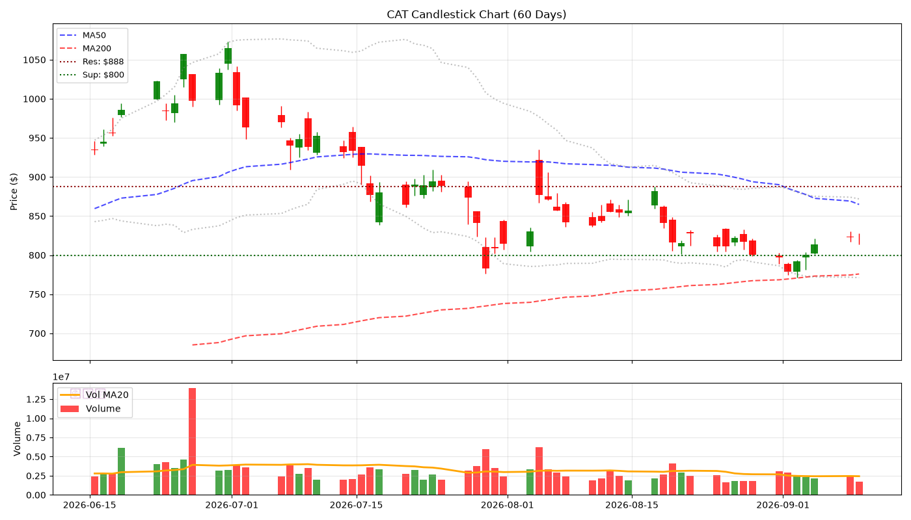
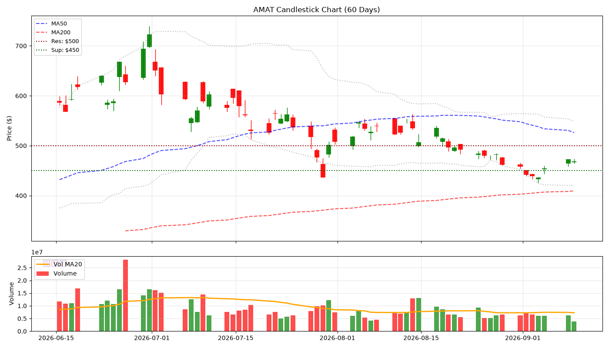

# 🕯️ Hermes V5 陰陽燭專業日報 - 2026-09-10
> **生成時間**: 2026-09-10 06:02:40 | **圖表**: 正宗陰陽燭 + Volume

---

## 📊 核心數據

| 股票 | 價格 | 漲跌% | RSI | 成交量 | 阻力 | 支撐 |
|------|------|-------|-----|--------|------|------|
| SNDK | $1764.17 | +1.51% | 68.5 | 💧 | $1800 | $1750 |
| MU | $1027.77 | +2.75% | 64.5 | 💧 | $1042 | $1000 |
| SOXL | $125.87 | +2.11% | 54.0 | 💧 | $150 | $100 |
| TSLA | $367.81 | -0.10% | 55.7 | 💧 | $384 | $350 |
| APP | $305.06 | -2.23% | 46.3 | 💧 | $335 | $300 |
| NOW | $131.11 | -2.31% | 53.1 | 💧 | $150 | $118 |
| CAT | $815.56 | -0.84% | 49.8 | 💧 | $888 | $800 |
| AMAT | $468.85 | -0.83% | 37.2 | 💧 | $500 | $450 |
| NOK | $10.76 | +1.03% | 61.4 | 💧 | $11 | $10 |
| ALAB | $300.54 | +4.05% | 53.7 | 💧 | $354 | $300 |

---

## 📈 個股陰陽燭分析

### SNDK ($1764.17, +1.51%)

- **RSI**: 68.5 | **Vol**: NORMAL
- **關鍵位**: 阻力 $1800.00 | 支撐 $1750.00

### MU ($1027.77, +2.75%)

- **RSI**: 64.5 | **Vol**: NORMAL
- **關鍵位**: 阻力 $1042.40 | 支撐 $1000.00

### SOXL ($125.87, +2.11%)

- **RSI**: 54.0 | **Vol**: NORMAL
- **關鍵位**: 阻力 $150.00 | 支撐 $100.00

### TSLA ($367.81, -0.10%)

- **RSI**: 55.7 | **Vol**: NORMAL
- **關鍵位**: 阻力 $384.04 | 支撐 $350.00

### APP ($305.06, -2.23%)

- **RSI**: 46.3 | **Vol**: NORMAL
- **關鍵位**: 阻力 $335.45 | 支撐 $300.00

### NOW ($131.11, -2.31%)

- **RSI**: 53.1 | **Vol**: NORMAL
- **關鍵位**: 阻力 $149.60 | 支撐 $117.59

### CAT ($815.56, -0.84%)

- **RSI**: 49.8 | **Vol**: NORMAL
- **關鍵位**: 阻力 $887.91 | 支撐 $800.00

### AMAT ($468.85, -0.83%)

- **RSI**: 37.2 | **Vol**: NORMAL
- **關鍵位**: 阻力 $500.00 | 支撐 $450.00

### NOK ($10.76, +1.03%)

- **RSI**: 61.4 | **Vol**: NORMAL
- **關鍵位**: 阻力 $11.15 | 支撐 $9.54

### ALAB ($300.54, +4.05%)

- **RSI**: 53.7 | **Vol**: NORMAL
- **關鍵位**: 阻力 $354.00 | 支撐 $300.00

*Generated by Hermes Agent V5 (Candlestick Pro)*