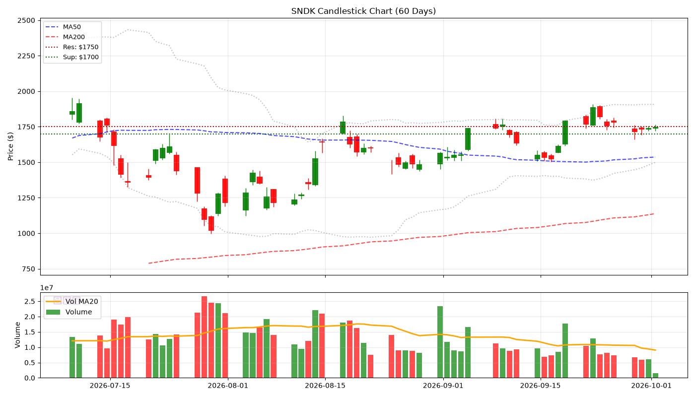
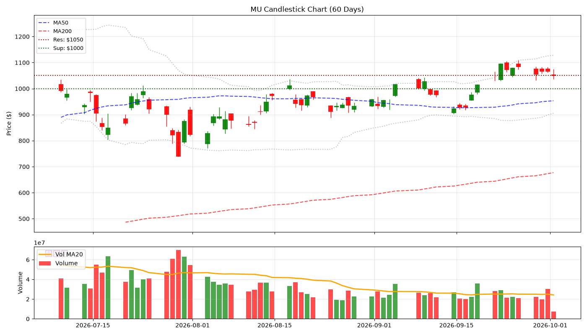
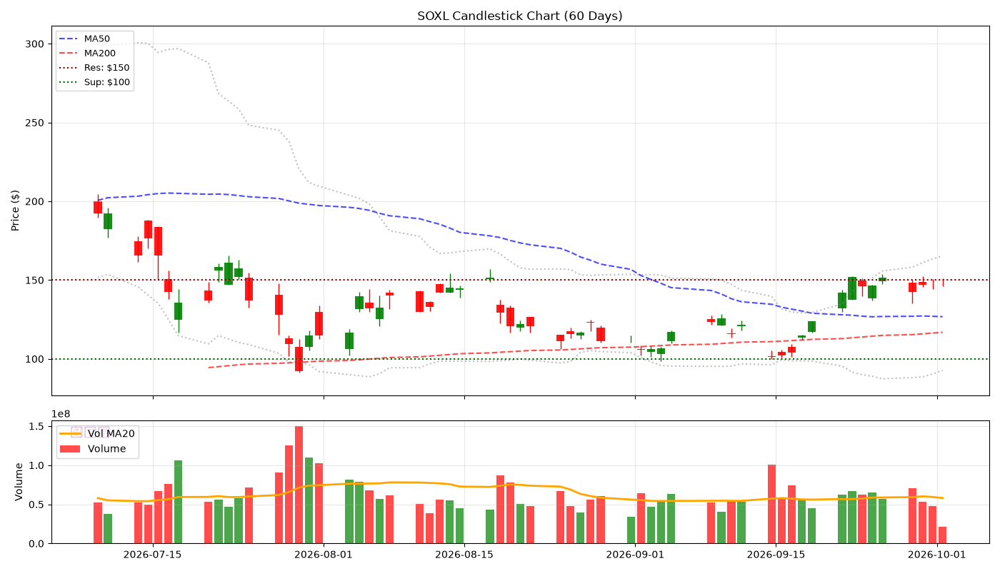
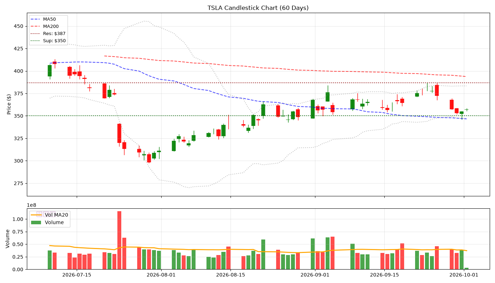
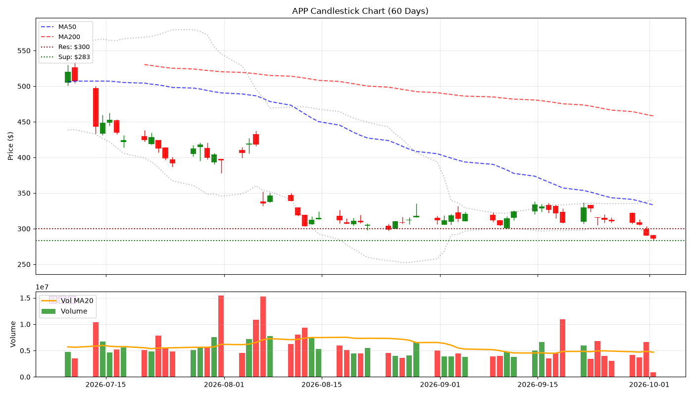
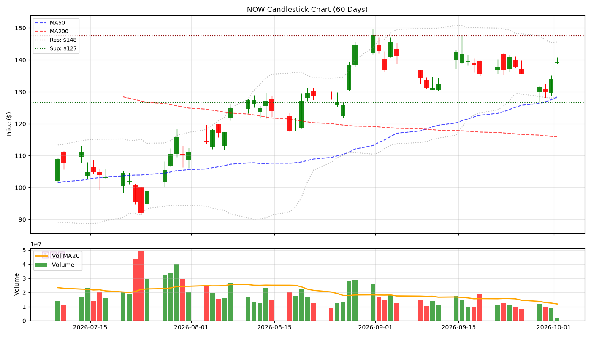
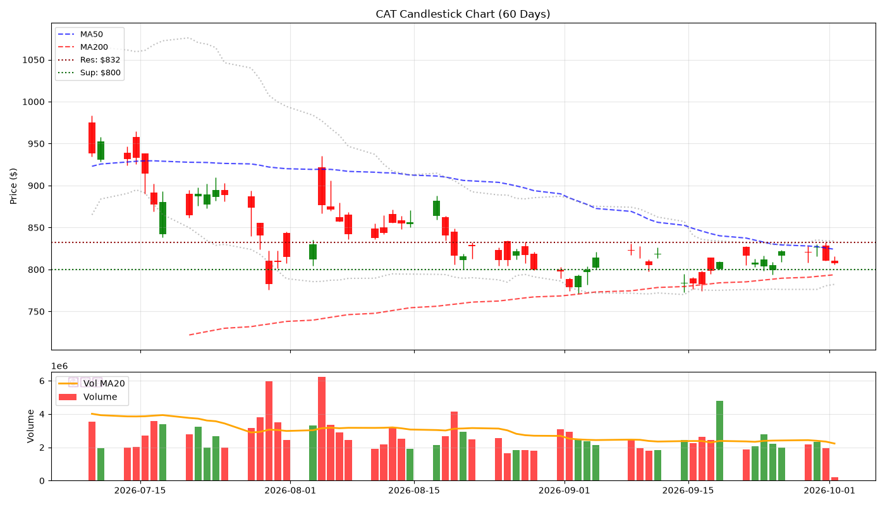
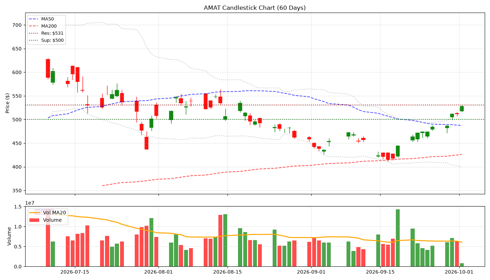
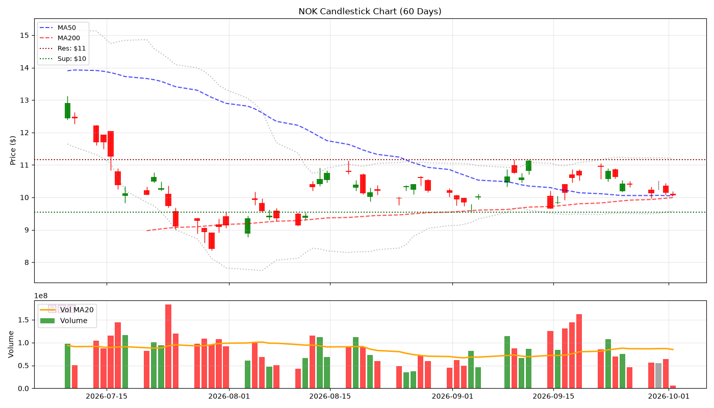
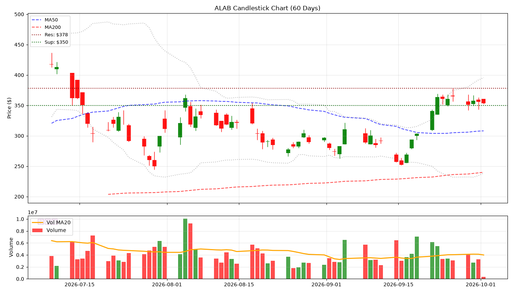

# 🕯️ Hermes V5 陰陽燭專業日報 - 2026-10-01
> **生成時間**: 2026-10-01 21:45:42 | **圖表**: 正宗陰陽燭 + Volume

---

## 📊 核心數據

| 股票 | 價格 | 漲跌% | RSI | 成交量 | 阻力 | 支撐 |
|------|------|-------|-----|--------|------|------|
| SNDK | $1748.97 | +0.52% | 57.3 | 💤 | $1750 | $1700 |
| MU | $1049.67 | -1.45% | 61.8 | 💤 | $1050 | $1000 |
| SOXL | $148.51 | +0.44% | 63.6 | 💤 | $150 | $100 |
| TSLA | $357.10 | +0.64% | 43.8 | 💤 | $387 | $350 |
| APP | $286.19 | -1.46% | 31.6 | 💤 | $300 | $283 |
| NOW | $139.34 | +3.98% | 57.8 | 💤 | $148 | $127 |
| CAT | $807.81 | -0.37% | 45.9 | 💤 | $832 | $800 |
| AMAT | $528.35 | +3.32% | 73.1 | 💤 | $531 | $500 |
| NOK | $10.07 | -0.71% | 37.1 | 💤 | $11 | $10 |
| ALAB | $353.40 | -0.72% | 67.2 | 💤 | $378 | $350 |

---

## 📈 個股陰陽燭分析

### SNDK ($1748.97, +0.52%)

- **RSI**: 57.3 | **Vol**: LOW
- **關鍵位**: 阻力 $1750.00 | 支撐 $1700.00

### MU ($1049.67, -1.45%)

- **RSI**: 61.8 | **Vol**: LOW
- **關鍵位**: 阻力 $1050.00 | 支撐 $1000.00

### SOXL ($148.51, +0.44%)

- **RSI**: 63.6 | **Vol**: LOW
- **關鍵位**: 阻力 $150.00 | 支撐 $100.00

### TSLA ($357.10, +0.64%)

- **RSI**: 43.8 | **Vol**: LOW
- **關鍵位**: 阻力 $386.83 | 支撐 $350.00

### APP ($286.19, -1.46%)

- **RSI**: 31.6 | **Vol**: LOW
- **關鍵位**: 阻力 $300.00 | 支撐 $283.10

### NOW ($139.34, +3.98%)

- **RSI**: 57.8 | **Vol**: LOW
- **關鍵位**: 阻力 $147.57 | 支撐 $126.75

### CAT ($807.81, -0.37%)

- **RSI**: 45.9 | **Vol**: LOW
- **關鍵位**: 阻力 $831.95 | 支撐 $800.00

### AMAT ($528.35, +3.32%)

- **RSI**: 73.1 | **Vol**: LOW
- **關鍵位**: 阻力 $530.94 | 支撐 $500.00

### NOK ($10.07, -0.71%)

- **RSI**: 37.1 | **Vol**: LOW
- **關鍵位**: 阻力 $11.17 | 支撐 $9.54

### ALAB ($353.40, -0.72%)

- **RSI**: 67.2 | **Vol**: LOW
- **關鍵位**: 阻力 $377.87 | 支撐 $350.00

*Generated by Hermes Agent V5 (Candlestick Pro)*